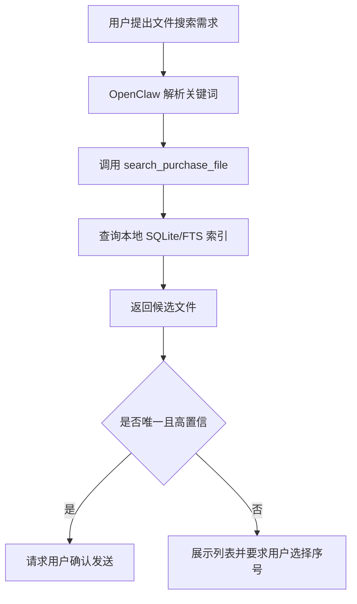
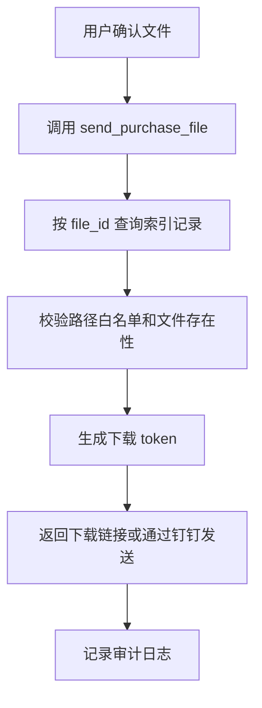
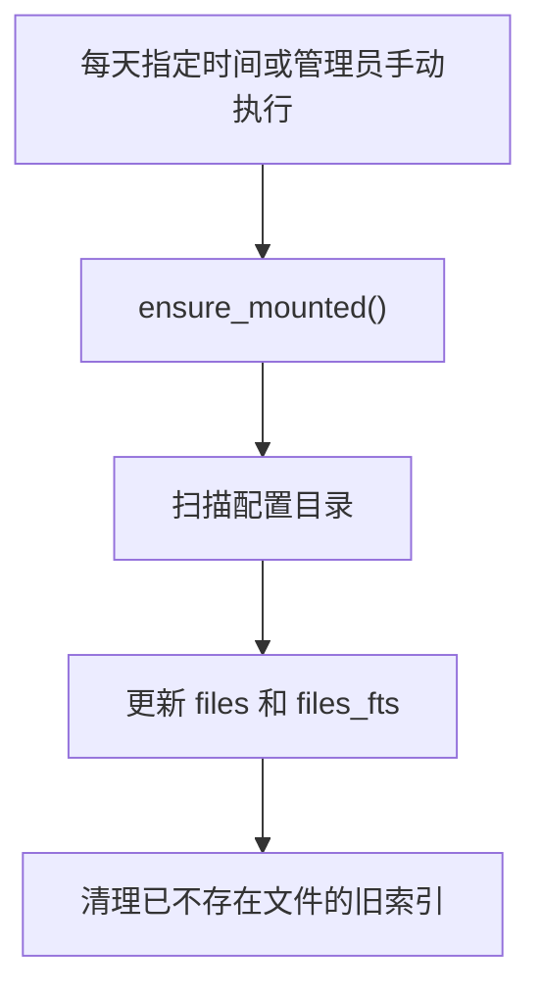

# PRD：采购文件搜索服务

## 目录

- [项目概述](#项目概述)
- [目标与范围](#目标与范围)
- [用户与角色](#用户与角色)
- [业务流程](#业务流程)
- [功能需求](#功能需求)
- [页面与交互](#页面与交互)
- [数据模型](#数据模型)
- [接口定义](#接口定义)
- [业务规则](#业务规则)
- [非功能要求](#非功能要求)
- [验收标准](#验收标准)
- [技术与实现约束](#技术与实现约束)

## 项目概述

采购同事希望在 OpenClaw 中通过自然语言对话，快速从群晖文件服务器中找到对应文件，并通过钉钉等渠道发送给用户。

本项目提供一个采购文件搜索服务：在 Linux 或 macOS 环境中挂载群晖 SMB 共享目录，扫描文件名和文件夹名并建立 OpenClaw 服务器本地 SQLite/FTS 索引。用户搜索时，OpenClaw 查询本地索引，而不是依赖群晖搜索。用户确认后，系统根据 `file_id` 生成可访问下载链接，或通过钉钉 webhook 发送链接。

## 目标与范围

### 目标

- 支持采购人员通过对话搜索采购文件。
- 支持根据文件夹名称和文件名称快速检索。
- 支持 Linux 生产部署和 macOS 本地调试。
- 支持自动识别系统并执行对应 SMB 挂载逻辑。
- 支持 macOS 复用 Finder 已挂载 SMB 共享。
- 搜索阶段查询 OpenClaw 服务器本地索引，不依赖群晖搜索。
- 支持生成可配置有效期的下载链接。
- 支持搜索结果数量和搜索模式可配置。
- 支持每天低频全量同步，可配置时间，默认 23:23。
- 支持管理员手动全量同步。
- 支持 HTTP API 供 OpenClaw 调用。

### 范围内

- Linux/macOS 系统识别。
- 群晖 SMB 共享目录挂载检查与挂载。
- 挂载共享目录后扫描指定子目录。
- 文件名、文件夹名、路径、扩展名、大小、修改时间索引。
- SQLite/FTS 本地搜索。
- 智能搜索、左包含、右包含、全包含、精准匹配。
- 下载 token。
- 下载链接有效期配置，`0` 表示永不过期。
- 每日定时全量同步。
- 手动全量同步。
- OpenClaw HTTP 工具接口。
- 钉钉 webhook 发送链接骨架。
- 基础审计日志。
- 失败运行日志。
- Docker 部署文件。

### 范围外

- 暂不做后台增量同步。
- 第一阶段不做文件正文解析。
- 第一阶段不依赖群晖 Universal Search 或 File Station 搜索。
- 第一阶段不直接实现企业级权限系统，只保留权限校验接口位置。
- 第一阶段不直接实现钉钉内部应用文件上传。

## 用户与角色

| 角色 | 说明 | 权限 |
|---|---|---|
| 采购用户 | 通过 OpenClaw/钉钉搜索和接收文件 | 搜索授权目录内文件，确认后接收链接 |
| 管理员 | 配置群晖连接、索引任务和服务部署 | 管理配置、启动服务、查看日志、手动同步 |
| OpenClaw Agent | 解析用户意图并调用工具 | 调用搜索工具和发送工具 |
| 文件搜索服务 | 执行挂载、索引、搜索、发送前校验 | 读取群晖挂载目录和本地索引 |

## 业务流程

### 搜索流程



### 发送流程



### 同步流程



## 功能需求

### FR-001 系统识别

系统必须使用 `platform.system()` 判断当前操作系统：

- `Linux`：使用 Linux CIFS/SMB 挂载逻辑。
- `Darwin`：使用 macOS `mount_smbfs` 挂载逻辑，且支持复用 Finder 已挂载共享。
- 其他系统：提示不支持。

### FR-002 群晖挂载

系统必须提供 `ensure_mounted()` 语义：

- 已挂载时直接返回挂载目录。
- macOS 下如果 Finder 已经挂载同一个 SMB 共享，程序应复用现有挂载路径。
- 未挂载时才执行挂载。
- 用户每次搜索时不得重复执行挂载。

### FR-003 子目录扫描

系统必须支持挂载 SMB 共享后，只扫描其中指定子目录。

### FR-004 本地索引

系统必须扫描挂载目录并写入本地 SQLite 索引。

第一阶段索引字段：

- 文件名。
- 文件夹路径。
- 完整路径。
- 扩展名。
- 文件大小。
- 修改时间。

索引任务必须清理已经不存在的旧文件记录。

### FR-005 索引同步

暂行同步策略：

- 每天低频全量同步一次，默认 `23:23`。
- 全量同步时间必须可配置。
- 是否启用每日全量同步必须可配置。
- 服务启动后是否立即全量同步必须可配置。
- 必须支持管理员手动全量同步。
- 删除后台增量同步。

配置示例：

```json
"index": {
  "auto_full_sync_enabled": true,
  "full_sync_time": "23:23",
  "full_sync_on_startup": false
}
```

背景依据：当前 92,108 个文件实测，全量同步约 289 秒，无变化目录级增量同步约 291 秒。瓶颈主要是 SMB 目录遍历/扫描，因此暂不做后台增量同步。

### FR-006 文件搜索

系统必须支持关键词搜索：

- 多关键词搜索。
- 文件名搜索。
- 文件夹名搜索。
- 中文连续文本的基础模糊匹配。

搜索时只查询本地索引，不实时遍历群晖目录。

搜索结果数量必须可配置：

- `max_results > 0` 表示默认最多返回 N 条。
- `max_results = 0` 表示默认返回所有符合条件的搜索结果。
- 接口参数 `limit` 可覆盖默认值，且 `limit = 0` 表示返回全部。

搜索模式必须可配置：

| 模式 | 中文别名 | 含义 |
|---|---|---|
| `smart` | `智能` | 智能搜索，兼容原有 FTS/LIKE/中文切片搜索 |
| `left_contains` | `左包含` | 文件名或目录以关键词开头 |
| `right_contains` | `右包含` | 文件名或目录以关键词结尾 |
| `contains` | `全包含` | 文件名或目录包含关键词 |
| `exact` | `精准匹配` / `精确匹配` | 文件名或目录完全等于关键词 |

### FR-007 候选确认

系统应在发送前要求用户确认，尤其是命中多个结果时。

### FR-008 下载链接

系统必须支持根据 `file_id` 生成下载链接。

有效期规则：

- `token_ttl_minutes > 0`：N 分钟后过期。
- `token_ttl_minutes = 0`：永不过期。

下载链接不得使用 `127.0.0.1` 发给用户，必须使用可配置的对外 IP、域名和端口。

### FR-009 审计日志与失败运行日志

系统应记录基础审计日志：搜索、生成链接、下载行为。

系统运行日志只记录失败事件，包括挂载失败、同步失败、API 失败、下载失败和未处理异常。失败日志路径必须可配置。

### FR-010 HTTP API 服务

系统应提供：

- `GET /health`
- `POST /search_purchase_file`
- `POST /send_purchase_file`
- `GET /download/{token}`

### FR-011 钉钉发送

第一阶段支持钉钉 webhook Markdown 消息发送链接。后续可扩展钉钉内部应用文件上传和单聊发送。

## 页面与交互

本项目第一阶段无独立前端页面，主要交互发生在 OpenClaw/钉钉对话中。

## 数据模型

核心数据表为：

- `files`：文件元数据表。
- `files_fts`：SQLite FTS5 全文索引虚拟表。
- `audit_logs`：审计日志表。
- `download_tokens`：下载 token 表。

详细字段见 [DatabaseSchema.md](./DatabaseSchema.md)。

## 接口定义

### search_purchase_file

```json
{
  "query": "DCC1039S.pdf",
  "search_mode": "exact",
  "limit": 0,
  "user_id": "test-user"
}
```

### send_purchase_file

```json
{
  "file_id": 21559,
  "recipient": "用户ID或群ID",
  "channel": "link",
  "user_id": "test-user"
}
```

## 业务规则

1. 搜索阶段只查询本地索引。
2. 发送阶段才访问群晖真实文件。
3. 用户每次搜索时不得重新挂载或扫描群晖。
4. 群晖挂载必须优先只读。
5. 不向普通用户暴露服务器真实绝对路径。
6. 发送前必须校验文件路径是否位于白名单目录内。
7. 文件不存在或已移动时，要求用户重新搜索或等待同步。
8. 多结果命中时必须让用户二次确认。
9. 下载链接有效期必须可配置。
10. `token_ttl_minutes = 0` 表示下载链接永不过期。
11. 下载链接不得使用 `127.0.0.1` 发给用户。
12. 密码和密钥不得提交到代码仓库。
13. 后台只保留每日全量同步，不做增量同步。

## 非功能要求

| 类型 | 要求 |
|---|---|
| 性能 | 常见关键词搜索应在 1 秒内返回 |
| 可用性 | 群晖短暂断开时，每日同步任务应能在下次重试 |
| 安全性 | 只读挂载、路径白名单、下载 token、审计日志 |
| 可维护性 | 服务器、共享名、挂载路径、索引路径、搜索模式、端口、全量同步时间均配置化 |
| 可部署性 | 至少支持 LinuxOS 部署，macOS 支持开发调试 |
| 可扩展性 | 后续可扩展正文搜索、更多发送渠道、权限系统、群晖 API 搜索 |

## 验收标准

- 可识别 Linux/macOS。
- 可复用 macOS Finder 已挂载 SMB 路径。
- 可扫描 SMB 共享下指定子目录。
- 可手动全量同步索引。
- 可配置每日全量同步时间，默认 `23:23`。
- 服务启动日志能显示每日全量同步配置。
- 可搜索文件并返回结果。
- 支持 `limit = 0` 返回全部结果。
- 支持五种搜索模式。
- 可生成下载链接。
- 可配置下载链接有效期，`0` 表示永不过期。
- 文档明确说明不做后台增量同步。

## 技术与实现约束

- 使用 Python 实现 MVP。
- MVP 尽量使用 Python 标准库。
- 本地索引使用 SQLite/FTS5。
- Linux 挂载使用 CIFS/SMB。
- macOS 挂载使用 `mount_smbfs` 或复用 Finder 挂载。
- 配置项不得写死在代码中。
- 文档统一放在 `docs/` 目录。
- 提供 Dockerfile 和 docker-compose.yml。
